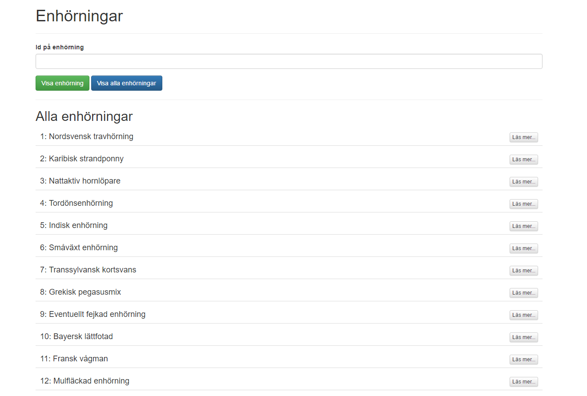
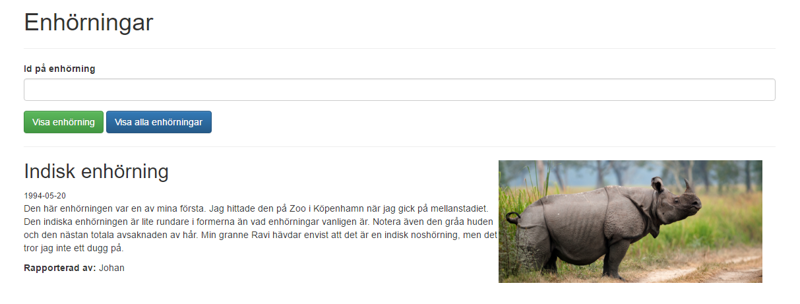
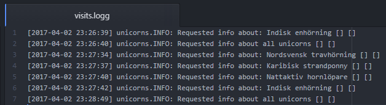

# Inlämningsuppgift 1

## Syfte

Syftet med uppgiften är i stora drag att ni ska:
- Bygga er första webbapplikation (`php`)
- Använda paket genom pakethanterare (`composer`)

Dessutom ska ni förhålla er till de stil-riktlinjer som finns när man skriver PHP-kod. Ni ska följa:
- [PSR-1: Basic Coding Standard](http://www.php-fig.org/psr/psr-1/)
- [PSR-2: Coding Style Guide](http://www.php-fig.org/psr/psr-2/)

## Uppgiften

### Introduktion

Vissa påstår att enhörningar är ett mytologiskt väsen, andra hävdar starkt att de faktiskt är verkliga - och att de finns runt omkring oss. Oavsett vem som har rätt så är det ett väldigt fascinerande djur, vars horn sägs ha magiska krafter, som t.ex. att väcka liv i de döda.

För att sprida information om enhöringar så har vi hittat en data-källa (i form ett API) som tillhandahåller just denna information i `JSON`-format. API:t hittar ni [här](http://unicorns.idioti.se/api.html).

### Webbapplikation

En webbapplikation ska byggas, denna ska ha följande funktionalitet:
- Ett GUI i HTML/CSS där följande vyer ska finnas:
    - Visa alla enhörningar från API:t
    - Visa detaljerad information om en specifik enhörning från API:t
        - I detta fall ska användaren kunna välja vilken enhörning som visas
- Webbapplikationen ska även logga när en användaren besöker någon av vyerna ovan

#### Enhörnings-API

Som tidigare nämnt så hittar ni API:t här [http://unicorns.idioti.se/](http://unicorns.idioti.se/api.html). Eftersom att API:t kan returnera data i olika format så är det viktigt att vi anger att vi vill ha data i `JSON`-format. Detta gör vi genom att ange följande information i vår _header_ i vårt HTTP-anrop:
- `Accept`: `application/json`

Annars finns risken att vi får tillbaka en `HTML`-sida som svar - och just i detta fall är det inte något som vi vill ska hända. För att hämta en lista på alla enhörningar så anger ni följande URL: [http://unicorns.idioti.se/](http://unicorns.idioti.se/), och för att hämta information om en specifik enhörning så ange ni ett *id* på slutet i sökvägen, t.ex. för enhörning med id: 3 [http://unicorns.idioti.se/3](http://unicorns.idioti.se/3).

För att göra HTTP-anrop i PHP så kan man t.ex. använda paketet [guzzle](https://github.com/guzzle/guzzle) eller [Unirest](http://unirest.io/php.html), vilket gör det enklare att ange t.ex. _headers_ i anropen, likt `accept` som är nämnt ovan.

#### Logga besök

Vi ska även i denna uppgift logga när de olika vyerna besöks, detta genom paketet [`monolog`](https://github.com/Seldaek/monolog), som ni säkert känner igen från laborationen. Ni ska använda composer för att ange information om er webbapplikation samt vilka beroende som finns till andra paket - för att applikationen ska fungera som förväntat. Det som ska loggas är:
- Varje gång en vy i er webbplats visas, alltså varje gång en användare använder er webbapplikation.

### Krav

Följande krav finns på uppgiften:
- Uppgiften ska följa uppgiftsbeskrivningen ovan
- Ni ska följa PSR-1 & PSR-2 när det gäller hur ni skriver er kod
- Ni ska använda composer för beroendehantering och information om ert projekt
- Ni ska använda Driessens GitFlow-modell

***Viktigt***, Inlämningsuppgiftens startfil ska heta `index.php`.

### Inlämning

Inlämningen sker genom att ni publicerar er lösning på [Github](github.com) och skickar in adressen till er lösning på Its learning. Glöm inte att uppgiften ska utföras och redovisas enskilt.

## Deadline

Uppgiften ska vara inlämnad senaste onsdagen den 18:e april, 23.59. Uppgifter som lämnas in efter deadline kommer att rättas i samband med nästa inlämningsuppgift.

## Bilder på exempellösning

### Visa alla enhörningar

### Visa specifik enhörning

### Exempel på loggning

### Exempelvideo på lösningen

