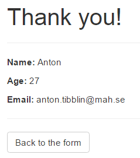
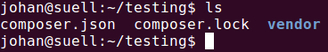

# Labb 1
I den första laborationen ska vi introduceras till php, dels genom CLI (command line interface) och genom webbserver. Tacksamt nog kommer PHP med en webbserver som är menad att använda under utveckling. Laborationen är uppdelad i följande delar:
1. Om PHP
    1. CLI - Första exempel
    2. WEB - Första exempel
    3. Hantera formulärsdata
2. Beroendehantering med Composer
    1. Analysera en composer.json-fil
    2. Skriv och hantera en egen composer.json-fil
    3. Skriv ett enkelt program med hjälp av Composer

## Förberedelser
Inför denna labb ska ni ha **installerat PHP, Apache och MySQL**. Detta kan ni antingen göra genom:
1. [Johans image](/Resources/vm_installation.md) för [VirtualBox](https://www.virtualbox.org/) (rekommenderat).
2. Genom [Xampp](https://www.apachefriends.org/index.html) för Windows/Mac OS X.

Johans image är rekommenderad då han kommer att supporta detta, då det innebär att alla har samma miljö. Dessutom kommer det krävas senare i kursen, gällande testning & deployment.

## 1. Om PHP
I denna del ska vi introduceras till språket PHP. Vi kommer titta på hur man kommer igång, samt skriver ett litet program i PHP. Avslutningsvis ska vi även se hur vi hanterar formulärsdata (alt. HTTP-anrop).

### 1.1. CLI - Första exempel
Här ska vi bygga ett litet program som välkomnar användaren, och komplementerar användarens namn. För att köra en PHP-fil i CLI så skriver man följande:
```php filename```
Alltså, för att köra filen `index.php` så skriver man:
```php index.php```

##### Övning: Hello World i CLI
Nu är det dags för er att köra ert första PHP-skript!
- Skapa en PHP-fil vid namn "helloWorld.php"
- Skriv PHP-kod för att skriva ut strängen _"hello world"_
- Kör filen i CLI genom `php helloWorld.php`

#### 1.2. Argument i CLI
Vill man sedan skicka med argument när man kör PHP-skriptet så gör man detta genom mellanslag efter filnamnet, t.ex. om jag vill skicka med _"hejsan"_ & _"hoppsan"_ som argument till filen `index.php` så skriver man:
```php index.php hejsan hoppsan```
För att fånga upp dessa parametrarna i PHP så använder man sig utan variabeln [`$argv`](http://php.net/manual/en/reserved.variables.argv.php) som är en array innehållandes de argument som skickas med genom CLI. Exempel:
- Genom CLI: ```php index.php hejsan hoppsan```
- I PHP:
  ```php
  <?php
  var_dump($argv);
  ````
  Ger följande utskrift:
  ```php
  array(3) {
  [0]=>
  string(9) "index.php"
  [1]=>
  string(6) "hejsan"
  [2]=>
  string(7) "hoppsan"
  }
  ```

 ##### Övning: Argument i CLI
 Skriv ett skript som välkomnar användare, genom att ta dess namn som en parameter. Följande anrop:
 `php index.php Anton`
 ska ge följande utskrift i CLI:
 ```
 Hello Anton! What a wonderful name!
 ```

 #### 1.3. Hantera formulärsdata
 I denna tredje del ska ni hantera data som skickas från formulär. Ni kommer att få en mall, [som ni laddar ner här](form.html), där det finns ett formulär. Studera detta formulär och identifiera följande:
 - Med vilken metod skickas formuläret?
 - Hur identifierar ni vilka namn som de olika fälten har?
 - Var skickas formulärsdata när formuläret skickas iväg?

När ni svarat på dessa frågor har ni kött på benen att bygga en svarssida, som ska presentera det som skickas iväg med formuläret. Skapa en sida som ser ut som denna:



 Vad händer om ni byter metod till *post* i formuläret? Vad blir skillnaden? Hur hanterar ni detta på er svarssida?

 ##### Tips
 *Tips 1* Tänk på att för att ni ska kunna köra PHP-filer så behöver ni köra filerna via en webbserver som har stöd för PHP. PHP har en sådan webbserver inbyggd som ni startar genom:

 ```
 php -S localhost:8000
 ```

 Detta kommer att starta en webbserver som lyssnar på port 8000. *Obs*, det är viktigt att ni startar denna server i samma mapp som ni arbetar i, så att ni kan surfa till era filer.

 *Tips 2* För att ta emot data som skickas med HTTP-metoden GET så använder man följande i PHP `$_GET['key']`, där _key_ är den nyckel som håller informationen man vill plocka ut. Ex.

 URL: `localhost:8000/index.php?name=Anton`

 För att plocka ut värdet `Anton` (genom nyckeln `name`) och spara i variabeln `$name` så skriver vi i PHP:

```php
$name = $_GET['name']
```

Om vi istället skickar data med HTTP-metoder POST, så använder vi `$_POST['key']`.

## 2. Beroendehantering med Composer

I den här delen kommer ni att få bekanta er med Composer som verktyg för beroendehantering i PHP. Vi kommer att lära oss hur composer.json-filer är uppbyggda, hur Composer används, samt att bygga en enkel applikation med beroenden. Ni kommer även att få bekanta er med Packagist och med semantisk versionering.

Rekommenderad läsning:
* [Basic usage - Composer](https://getcomposer.org/doc/01-basic-usage.md)
* [Versions - Composer](https://getcomposer.org/doc/articles/versions.md)
* [Semantic Versioning 2.0.0](http://semver.org/spec/v2.0.0.html)

### 2.1. Analysera en composer.json-fil

Givet filen [composer.json](composer.json), besvara följande frågor:

1. Vad gör det här paketet?
2. Vem är paketets utgivare?
3. Har utgivaren släppt några fler paket? Om ja, vilka?
4. Finns det några nyare versioner av paketet? Om ja, är de bakåtkompatibla med det här paketet?
5. Paketet anger en licens. Medger den att ni får använda den i ett publikt projekt?
6. Följer paketet någon standard för autoloading?
7. Ditt billiga webbhotell kör fortfarande PHP 5.2.4. Kommer du att kunna köra det här paketet där? Om ja, varför?
8. Paketet kräver PHPUnit. Kommer det att installeras på en produktionsserver?

### 2.2. Skriv och hantera en egen composer.json-fil

Du kommer nu att få testa att skapa och underhålla en egen composer.json-fil med hjälp av Composers interaktiva verktyg. För den här delen kommer ni att använda er av terminalen, så öppna upp ett terminalfönster innan ni går vidare.

#### 2.2.1. Skapa ett Composer-projekt

Vi drar igång direkt med att skapa en katalog för ert nya projekt, som vi döper till *testing*. I Unix/Linux görs detta genom att skriva

```
$ mkdir testing
```

i terminalen. Kommandot `mkdir` står för *"make directory"*, och argumentet är det önskade namnet på katalogen. Gå sedan in i katalogen genom att skriva

```
$ cd testing
```

i terminalen. Kommandot `cd` läses som *"change directory"*. Vi är nu klara att initialisera ett Composer-projekt. Skriv in

```
$ composer init
```

för att börja. Vi vill att vår composer.json ska ha följande information:

* Paketet ska heta mau/testing
* Paketet ska ha en kort beskrivning
* En utgivare ska vara angiven
* Vi litar bara på stabila utgåvor av paket
* Paketet ska vara licensierat med BSD-licensen
* Paketet ska ha följande beroenden:
  * catfan/medoo, version 1.1 eller senare
  * kronos/log, senaste versionen
* Vi vill också använda PHPUnit för testningen

När composer.json är genererad, installerar vi alla beroenden med hjälp av

```
$ composer install
```

Säkerställ att allt installerats genom att skriva

```
$ ls
```

i terminalen. Kommandot `ls` står för *list*, och används för att lista filer. Om listningen innehåller *composer.json*, *composer.lock* och *vendor* (se bild nedan) har allt fungerat bra.



#### 2.2.1. Tillägg av nya beroenden

I takt med att ett projekt växer, uppstår det ofta behov av att använda fler paket i mjukvaran. Composer har stöd för detta genom kommandot `composer require`. Vi vill att vårt projekt ska använda sig av mikroramverket Slim (*slim/slim*). Lägg till det och säkerställ att det lagts till genom att skriva

```
$ cat composer.json
```

i terminalen. Kommandot `cat` skriver ut innehållet i en fil i terminalen. Om Slim syns i beroendelistan har allt fungerat.

#### 2.2.2. Ersättning för paket

Ibland dyker det upp nya paket som är bättre än de alternativ som används i projektet, exempelvis för att det nuvarande inte längre fungerar med en ny version av miljön. Om ett team bestämmer sig för att byta till ett nytt paket, kan Composer hantera borttagning av beroenden. Detta görs med kommandot `composer remove paketnamn`. Testa att ersätta paketet *kronos/log* med *monolog/monolog*.

#### 2.2.3. Uppdatering av paket

Om ett paket kommer i en ny version med funktionalitet som krävs för ditt projekt, måste din composer.json uppdateras för att spegla det nya kravet. Detta görs med kommandot `composer require paketnamn:version`. Testa att kräva version 1.2 eller nyare av *catfan/medoo*. Om allt fungerat bra, kommer förändringen att kunna ses när vi kör `cat composer.json`igen.

#### 2.2.4 Uppdatering av installationen

Om projektteamet som ni jobbar med har uppdaterat projektets beroenden måste ni även uppdatera er installation. Detta görs med kommandot `composer update`. Ha för vana att köra detta kommando när ni hämtar hem en ny version av projektet.

### 2.3. Skriv ett enkelt program med hjälp av Composer

I det här avsnittet skriver vi ett väldigt enkelt program som loggar utskrifter till en fil. Vi utgår från programmet som ni skrev i avsnitt 1.2. Stå kvar i *testing*-projektet från uppgift 2.2, men kopiera över *index.php* från 1.1 till aktuell katalog med hjälp av kommandot `cp`, som står för *copy*. Om er *index.php* ligger i */home/student/*, kopierar ni filen genom att skriva

```
$ cp /home/student/index.php .
```

Punkten läses ut som *"hit"* eller *"här"*. Öppna sedan filen med `nano` och ladda in era beroenden genom att låta de första fem raderna i filen se ut så här:

```php
<?php
require 'vendor/autoload.php';

use Monolog\Logger;
use Monolog\Handler\StreamHandler;

$log = new Logger('Laboration 1');
$log->pushHandler(new StreamHandler('greetings.log', Logger::INFO));
```

Vi kan nu logga strängar till filen *greetings.log*, som kommer att skapas när scriptet körs. Logga till filen genom att använda funktionen `$log->info()`, som tar en sträng som argument. Naturligtvis vill vi att samma glada hälsning som i 1.1 även skrivs ut i filen. När ni är klara med att uppdatera filen, körs den som vanligt genom att skriva

```
$ php index.php Johan
```

Öppna upp loggfilen genom att skriva

```
$ cat greetings.log
```

Om hälsningen syns, har allt fungerat.
