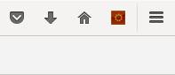
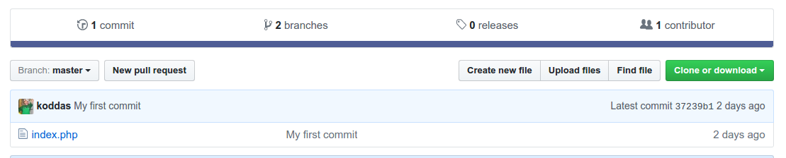

# Labb 2
I den andra laborationen tittar vi på versionshanteirng med Git och tittar på HTTP + REST. Vi kommer bland annat att bekanta oss med [Git](https://git-scm.com/), [GitHub](https://github.com) och branch-modellen [GitFlow](http://nvie.com/posts/a-successful-git-branching-model/). Vi tar också en titt på verktyget [RESTClient](https://addons.mozilla.org/sv-se/firefox/addon/restclient/) och leker med ett REST-API. Laborationen är uppdelad i följande delar:

1. Versionshantering med Git
	1. Introduktion till Git
	2. Delning av kod med GitHub
	3. Semantisk versionering med GitFlow
2. Introduktion till HTTP och REST
	1. RESTClient
	2. Utforska enhörnings-API:t
	3. HTTP-anrop med PHP
	4. GUI med Bootstrap

## Förberedelser
Inför denna labb ska ni ha **skapat ett konto på Github**, **installerat GitFlow** och **installerat Postman eller RESTClient**.

### Skapa ett konto hos Github

Gå in på [Github](https://github.com/) och fyll i registreringsformuläret på förstasidan om du inte redan har ett konto där.

### Installera GitFlow

På den virtuella maskinen installerar du GitFlow genom att skriva

```bash
$ sudo apt-get install git-flow
```

Det går även att installera GitFlow på macOS eller Windows. Installationsanvisningar finns här](https://github.com/nvie/gitflow/wiki/Installation).

### Installera RESTClient

[RESTClient](https://addons.mozilla.org/sv-se/firefox/addon/restclient/) är ett tillägg till Firefox. Öppna upp länken i Firefox på den virtuella maskinen och klicka på knappen "+ Lägg till i Firefox", godkänn installationen och starta om Firefox. RESTClient nås nu genom den röda ikonen i det övre högra hörnet i Firefox (se bild nedan).



## 1. Versionshantering med Git

### 1.1. Introduktion till Git

GitHub har en enkel [online-guide för Git](https://try.github.io). Testa den innan du går vidare.

Nät du har gått guiden testar vi att börja versionshantera förra veckans bygge med Git. Öppna upp ett terminalfönster och navigera till den kod du skrev förra veckan. Om den ligger i */home/student/testing*, räcker det med att du skriver

```bash
$ cd testing
```

Initiera ett Git-repository genom att skriva

```bash
$ git init
```

#### Ange filer som inte ska versionshanteras

Det finns filer som vi inte vill versionshantera. Vi har tidigare i kursen prata om att undvika att versionshantera de bibliotek som vi laddar ner med Composer. Vi gör detta genom att ändra i filen *.gitignore*, som innehåller information om vilka filer som Git kommer att bortse från. Skapa och öppna filen genom att skriva

```bash
$ nano .gitignore
```

I filen skriver du en enda rad innan du sparar och avslutar nano igen:

```
/vendor/
```

`/vendor/` är namnet på den katalog i vilken Composer sparar alla nedladdade bibliotek. Gör en * första commit av *.gitignore* genom att skriva:

```bash
$ git add .gitignore
$ git commit -m "Added a .gitignore file"
```

#### Vår första riktiga commit

Lägg sedan till alla andra filer genom att skriva

```bash
$ git add .
```

Säkerställ att filen är tillagd genom att skriva

```bash
$ git status
```

Skapa sedan en commit och ge den ett vettigt commit-meddelande:

```bash
$ git commit -m "A decent commit message"
```

Nu är den aktuella versionen av koden sparad i ditt repository.

#### En första uppdatering av koden

Vi vill komplettera förra veckans loggningsexempel så att vi kan köra det på webben. Bygg ut din *index.php* så att den ser ut så här:

```php
<?php
require 'vendor/autoload.php';

use Monolog\Logger;
use Monolog\Handler\StreamHandler;

$log = new Logger('Laboration 1');
$log->pushHandler(new StreamHandler('greetings.log', Logger::INFO));

$name = $_GET['name'];
$log->info($name);
?>
<!DOCTYPE html>
<html>
<head>
<title>Testing, testing</title>
</head>
<body>
<?php
echo "Hello, " . $name;
?>
</body>
</html>
```

Spara och avsluta. Starta upp PHPs testserver genom att skriva

```bash
$ php -S localhost:8080
```

Gå in på [http://localhost:8080](http://localhost:8080) och säkerställ att allt fungerar. Avsluta sedan servern.

### 1.2. Delning av kod med Github

Det fina med Git är att det är ett distribuerat versionshanteringssystem. Det går att skicka repositories mellan olika utvecklare, men i praktiken görs det oftast genom att använda en central repository-tjänst, som exempelvis GitHub.

#### Dela kod på GitHub

Börja med att gå till [GitHub](https://github.com) och skapa ett repository genom att klicka på knappen **Start a project**. Ange ett passande namn, exempelvis *testing*. Lägg inte till några filer, utan klicka direkt på **Create repository**. Det är helt okej att projektet är offentligt, du kan alltid ta bort det senare.

Du får nu ett antal val att göra. Det tredje alternativet (*...or push an existing repository from the command line*) är det vi är ute efter. Kopiera kommandona som finns beskrivna och kör i terminalen från den plats där din Git-hanterade källkod finns:

```bash
$ git remote add origin https://github.com/koddas/testing.git
$ git push -u origin master
```

Observera att *koddas* är Johans användarnamn på GitHub, så du måste byta ut det mot ditt eget. Observera även att *testing.git* är ett namn som beror på vad du valde att ditt projekt skulle heta.

Ditt projekt finns nu på GitHub. Gå in på GitHub och hitta det. Testa att göra några förändringar i din fil och lägg till en extra fil med valfritt innehåll. Skicka sedan upp förändringarna på GitHub.

##### Ge skrivrättigheter till andra personer

Vem som helst kan ta ditt projekt (om det är offentligt) och vidareutveckla det. De kan även föreslå att du använder deras förbättringar genom att skapa en *pull request*. En del personer litar du troligtvis mer på, och dessa kan du ge skrivrättigheter till ditt projekt. Hitta någon eller några av dina medstudenter och lägg till dem som collaborators i ditt projekt. Du gör detta genom att klicka på fliken **Settings** och sedan välja **Collaborators** i menyn. Ange ditt lösenord och gå vidare. Du kan nu lägga till dina betrodda medmänniskor genom att ange deras användarnamn eller e-postadresser. GitHub skickar nu en inbjudan till berörda parter via e-post.

#### Arbeta med existerande projekt på GitHub

Att bidra och vidareutveckla existerande projekt är en viktig del av Git-tanken. Det finns två sätt att göra detta på: genom att *klona* ett existerande projekt, eller genom att *forka* ett existerande projekt.

##### Klona ett projekt

När du klonar ett projekt på GitHub skapar du en lokal kopia av repositoryt på din dator. Om ägaren till repositoryt har angett dig som collaborator kan du använda `git push` för att uppdatera repositoryt med ny kod. Om du inte är en collaborator, kommer du inte att kunna göra detta. Testa att klona ett projekt, exempelvis *Medoo* som vi tittade kort på under förra labben:

```bash
$ git clone https://github.com/catfan/Medoo
```

Säkerställ att projektet klonats genom att skriva

```bash
$ ls
```

Syns projektet i listan har allt gått väl.

##### Forka ett projekt

Att forka ett projekt på GitHub är lite annorlunda mot att klona det. Genom att forka ett projekt, skapas en kopia av projektet på GitHub med dig som ägare. Denna kopia kan du sedan klona ner lokalt som ovan och sedan uppdatera med `git push`. Testa detta genom att gå in på exempelvis [Johans förolämpningsgenerator](https://github.com/koddas/php-web-application) och klicka på knappen **Fork** i det övre högra hörnet. Nu har du tillgång till en egen kopia av projektet på *https://github.com/ditt_användarnamn/php-web-application*. Testa att klona projektet på samma sätt som i föregående avsnitt, göra en förändring i koden och sedan skicka upp den till ditt forkade repo på GitHub igen.

### 1.3. Semantisk versionering med GitFlow

Vi ska nu bekanta oss med med GitFlow. Gå till projektet som vi arbetade med i uppgift 1.1. och intialisera GitFlow-modellen genom att skriva

```bash
$ git flow init -d
```

GitFlow sätter nu upp ett antal regler för hur olika avgreningar ska namnges. Med hjälp av växeln `-d` anger vi att vi vill använda GitFlows förvalda namngivningsrgler. Du kommer att se något i stil med:

```
Using default branch names.

Which branch should be used for bringing forth production releases?
   - develop
   - master
Branch name for production releases: [master]

Which branch should be used for integration of the "next release"?
   - develop
Branch name for "next release" development: [develop]

How to name your supporting branch prefixes?
Feature branches? [feature/]
Bugfix branches? [bugfix/]
Release branches? [release/]
Hotfix branches? [hotfix/]
Support branches? [support/]
Version tag prefix? []
Hooks and filters directory? [/home/student/testing/.git/hooks]
```

Säkerställ att du arbetar i develop-branchen genom att skriva

```bash
$ git branch
```

Får du svaret

```
* develop
  master
```

har allt fungerat som det ska. Vad vi har kvar att göra är att publicera develop-branchen på GitHub. Vi gör det genom att skriva

```bash
$ git push -u origin develop
```

Gå in på GitHub och titta på ditt projekt. Du ska nu kunna se två brancher (se bild nedan). Klicka på länken med texten *2 branches*. Du får nu upp en lista av alla dina brancher (i det här fallet två). Det är en god idé att byta ut den förvalda branchen från *master* till *develop* genom att klicka på knappen **Change default branch** och jobba sig vidare därifrån.



Du kan nu avgrena feature-, release- och hotfix-brancher som du vill. Vi kommer att testa att arbeta med en feature-branch, en release-branch, göra en release och testa på att lösa en merge-konflikt.

#### Feature-brancher

Vi ska testa att byta ut bakgrundsfärgen på vår webbsida genom att lägga till en CSS-fil.

##### Skapa en feature-branch

Börja med att skapa en feature-branch kallad *feature/yellow-background* genom att skriva följande i terminalen:

```bash
$ git flow feature start yellow-background
```

Om du nu skriver

```bash
$ git branch
```

kommer du att se att du numera har tre branches och att din aktiva branch just nu är *feature/yellow-background*.

##### Gör filändringar

Skapa en fil kallad *background.css* i projektkatalogen med exempelvis nano genom att skriva

```bash
$ nano background.css
```

Skriv in följande i filen

```css
body {
  background-color: yellow;
}
```

och spara sedan innan du avslutar programmet. Öppna nu upp PHP-filen och lägg till fölljande rad i head-elementet:

```html
<link rel="stylesheet" type="text/css" href="background.css">
```

Säkerställ att webbsidan är gul genom att starta upp PHP-servern och gå in på [http://localhost:8080?name=Johan](http://localhost:8080?name=Johan). När du sett att webbsidan är gul är det dags att göra en commit. Gör det genom att skriva

```bash
$ git add .
$ git commit -m "Added a yellow background"
```

I ett verkligt projekt hade vår feature-branch haft betydligt fler commits och eventuellt delats med andra utvecklare, men vi nöjer oss med det här för labben. Vi går nu vidare till att mergea in vår feature-branch i *develop* och avsluta *feature/yellow-background* genom att skriva

```bash
$ git flow feature finish yellow-background
```

Om du nu skriver

```bash
$ git branch
```

kommer du att se att feature-branchen är borttagen och att du är tillbaka i *develop*. Om du startar upp PHP-servern igen kommer du att se att bakgrunden fortfarande är gul, vilket vi hade förväntat oss.

#### Release-brancher

Nästa steg är att göra en release. Eftersom vårt projekt är bra nog för en publik release vill vi namnge den versionen *1.0.0*. Skapa en release genom att köra

```bash
$ git flow release start 1.0.0
```

Passa på att uppdatera beskrivningen av ditt projekt genom att öppna *composer.json* och gör en mindre ändring av värdet som nyckeln *description* pekar på. Spara sedan och gör en commit.

#### Förbered en merge-konflikt

Här gör vi en mindre paus för att simulera en merge-konflikt som du garanterat kommer att stöta på. Växla till *develop* genom att skriva

```bash
$ git checkout develop
```

Gör en ny, men annorlunda förändring av projektbeskrivningen och skapa en ny commit. När du är klar, växla tillbaka till release-grenen genom att skriva

```bash
$ git checkout release/1.0.0
```

#### Förbered en release

Vi är nu klara att göra releasen genom att skriva följande:

```bash
$ git flow release finish 1.0.0
```

Du kommer nu att få ange ett commit-meddelande med hjälp av nano. När du är nöjd, spara och avsluta. Du kommer direkt att skickas till nano igen, den här gången för att ange ett meddelande rörande release 1.0.0-taggen. Ange något bra, exempelvis "My first release. Yay!" Du kommer att få ett felmeddelande om att det uppstått en konflikt som du måste lösa. Vilka filer som bråkar ser du genom att skriva

```bash
$ git status
```

#### Lös merge-konflikten

Vi vet från ovan att vi måste fixa *composer.json*, så vi öppnar upp den filen. De rader som kolliderar markeras med

```
<<<<<<< HEAD
"description": "Beskrivningen som finns i develop",
=======
"description": "Beskrivningen som finns i release-branchen",
>>>>>>> 1.0.0
```

Spara den rad som finns mellan `=======` och `>>>>>>> 1.0.0` och ta bort de övriga fyra. I en verklig konflikt hade det troligtvis funnits större problem, och då kan ett grafisk verktyg vara enklare att använda. Mer information om merge-konflikter [finns på GitHub](https://help.github.com/articles/resolving-a-merge-conflict-using-the-command-line/).

#### Slutför releasen

Vi är nu slutligen klara att slutföra releasen. Skriv

```bash
$ git flow release finish 1.0.0
```

igen. Notera att Git har sparat våra meddelanden från förra försöket och du behöver därför inte skriva in dem igen. När vi är klara med releasen, vill vi så klart göra en push till GitHub:

```bash
$ git push --all
```

Du har nu pushat alla dina branches (dvs *master* och *develop*). Eftersom vi har skapat en ny version (1.0.0), vill vi även skicka med tag-informationen:

```bash
$ git push --tags
```

## 2. Introduktion till HTTP och REST
När man arbetar med webben så inkluderar detta ofta att man hanterar data mellan olika källor. I denna labb innebär det att vi kommer att arbeta med data om enhörningar, närmare bestämt med data från det enhörnings-API som ni hittar på följande adress: [http://unicorns.idioti.se/](http://unicorns.idioti.se/). Surfa till sidan om bekanta er med dess uppbyggnad, som egentligen består av två vyer:
- Visa alla enhörningar
- Visa information om en specifik enhörning
Notera vilka URL:r som används för att visa alla enhörningar/information om en specifik enhörning. Ser ni ett mönster?

### 2.1. Postman / RESTClient
När man arbetar med API:r så är det bra att ha dokumentation kring det API som man arbetar med. Så att man kan se vilka tjänster som API:t tillhandahåller. I vårt fall finns dokumentation om enhörnings-API:t på denna adress [http://unicorns.idioti.se/api.html](http://unicorns.idioti.se/api.html). Läs igenom detta - och fråga labbhandledaren om oklarheter finns.

När ni satt er in API:t så är det dags att testa API:t! Eftersom det inte är helt enkelt att testa annat än `GET`-metoder från webbläsaren så använder man ofta verktyg till detta. Exempel på sådana verktyg är [`Postman`](https://chrome.google.com/webstore/detail/postman/fhbjgbiflinjbdggehcddcbncdddomop), som är en app till Chrome och [`RestClient`](https://addons.mozilla.org/sv-se/firefox/addon/restclient/) som är ett addon till Firefox. Genom dessa verktyg kan man enkelt testa att anrop olika API:r.

- Installera valfritt verktyg ovan.

### 2.2. Utforska enhörnings-API:t
Vi kommer här att fokusera på att *hämta* data från vårt enhörnings-API, alltså att använda oss utav GET-metoden. Återigen - ha API-dokumentationen nära till hands för att se hur det fungerar: [http://unicorns.idioti.se/api.html](http://unicorns.idioti.se/api.html). I Postman/RestClient gör följande:

1. Hämta ut alla enhörningar:
	- I HTML-format
	- I JSON-format
	- I XML-format
2. Hämta ut detaljerat information om en specifik enhörning (valfri):
	- I HTML-format
	- I JSON-format
	- I XML-format

API:t stödjer även fler HTTP-metoder, så som `POST` - för att lägga till en enhörning, `PUT` - för att uppdatera en enhörning och `DELETE` för att ta bort en enhörning. Skulle ni ha sätt någon cool enhörning som ni vill lägga till i databasen går detta utmärkt - men radera eller uppdatera ej de enhörningarna som just nu finns i databasen.

### 2.3. HTTP-anrop med PHP
Nu är det dags att att göra våra HTTP-anrop genom PHP (och grunden till vår kommande webbapplikation). Detta kan man göra genom PHP:s egna inbyggda funktioner, men det är mycket enklare att använda paket för detta t.ex. [guzzle](https://github.com/guzzle/guzzle) eller [Unirest](http://unirest.io/php.html). I exemplet nedan används *guzzle*:

```php
<?php
require("vendor/autoload.php");

use GuzzleHttp\Client;

// Skapa en HTTP-client
$client = new Client();

// Anropa URL: http://unicorns.idioti.se/
$res = $client->request('GET', 'http://unicorns.idioti.se/');

// Omvandla JSON-svar till datatyper
$data = json_decode($res->getBody());

// @TODO Gör något fantastiskt med vår data!
```

*OBS.* Tänk på att att skapa er composer-fil, och ange de paket som ni använder där!

Mer dokumentation kring paketen hittar ni på deras webbplatser: [guzzle](https://github.com/guzzle/guzzle) eller [Unirest](http://unirest.io/php.html). Nu till lite uppgifter för er:

1. Genom PHP hämta alla enhörningar (i JSON) och skriv ut de på er sida, genom egenskapad HTML-kod.
2. Genom PHP hämta detaljerad information om en enskild enhörning (i JSON) och skriv ut de på er sida, genom egenskapad HTML-kod.

### 2.4. GUI med Bootstrap
Vi vill ju bytta ett GUI i HTML/CSS för vår webbapplikation. Har ni inte koll på HTML så gå [denna kurs på CodeAcademy](https://www.codecademy.com/learn/web). När ni börjar få koll på HTML så rekomenderar jag att ni använder er utav ett CSS-ramverk för att styla er sida, rekomenderat här är [Bootstrap](http://getbootstrap.com/). På startsidan på [Bootstraps - Getting started](http://getbootstrap.com/)-sida finns flera mallar att utgå från. Bygga nu ett lämpligt GUI för er tjänst - så är ni redo att hoppa till [inlämningsuppgiften](../../Assignments/1/assignment.md) sedan!
