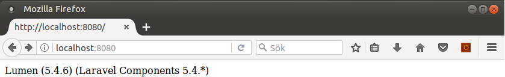

# Labb 3 - Lumen

I denna laboration ska vi använda ramverket [Lumen](http://lumen.laravel.com) för att bygga ett enkelt API. Vårt API ska vara väldigt enkelt och hantera en samling av produkter. Vårt API ska erbjuda att:
- Lista alla produkter
- Lista en vald produkt (genom id)
- Skapa en ny produkt
- Uppdatera en produkt
- Radera en produkt
Under labben kommer vi att jobba med olika delar av lumen. [Lumens dokumentation](https://lumen.laravel.com/docs/) är mycket bra att ha nära till hands då.

## 1. Skissa upp ert API
Frågor som ni ska besvara innan ni börjar bygga er webbtjäst är:
- Vilken/vilka resurser ska vi erbjuda?
- Vilka URI ska vi använda & vilka HTTP-metoder är kopplade till dessa?

Skissa upp detta, så att ni vet hur ert API ska utformas.

*Visa detta för labbhandledaren för att stämma av att det ser bra ut*

## 2. Installera Lumen
Eftersom att vi ska jobba i Lumen så är det viktigt att ni skapar ett `Lumen`-projekt att arbeta i. Vill vi använda Lumens egna installator så behöver vi snabbt konfigurera vår miljö.

## 2.1. Förberedelser inför Lumen-installation

#### Uppdatera `.bashrc`
Öppna filen `.bashrc` genom:
```bash
$ nano .bashrc
```
Längst ner i filen skriv:
```
export PATH="$PATH:~/.config/composer/vendor/bin"
```
Spara filen och avsluta. Stäng terminalen och öppna den igen.

#### Installera php-zip
Laravel behöver paketet *php-zip* för att kunna köras. Installera detta genom att skriva

```bash
$ sudo apt-get install php-zip
```

#### Uppdatera till PHP 7.1
Den senaste versionen av Laravel kräver PHP 7.1 eller nyare för att köras. Detta finns inte i vår version av Ubuntu, men det går självklart att lösa ändå. Gör så här:

Börja med att lägga till ett repository som tillhandahåller paket för PHP 7.1 i Ubuntu genoma tt köra

```bash
$ sudo apt-get install software-properties-common
$ sudo add-apt-repository ppa:ondrej/php
$ sudo apt-get update
```

När detta är tillagt går det utmärkt att uppdatera till den nyare versionen. Eftersom PHP 7.1 inte tillhandahålls av Canonical (företaget som ger ut Ubuntu) kommer PHP 7.0 fortfarande att vara förvalt. Detta gör att vi explicit måste begära version 7.1 av de PHP-paket som behövs. Gör detta genom att ange följande:

```bash
$ sudo apt-get install php7.1 libapache2-mod-php7.1 php7.1-common php7.1-mbstring php7.1-xmlrpc php7.1-gd php7.1-xml php7.1-intl php7.1-mysql php7.1-cli php7.1-mcrypt php7.1-zip php7.1-curl
```

Nu måste vi berätta för webbservern Apache att vi vill använda oss av PHP 7.1. Vi gör detta genom att skapa länkar till PHP 7.1-konfigurationsfilen och laddningsanvisningarna genom att använda oss av kommandot *ln -s*.

```bash
$ sudo ln -s /etc/apache2/mods-available/php7.1.conf /etc/apache2/mods-enabled/php7.1.conf
$ sudo ln -s /etc/apache2/mods-available/php7.1.load /etc/apache2/mods-enabled/php7.1.load
```

Nu tar vi bort länkarna till PHP 7.0. Gör vi inte detta, kommer Apache fortfarande att läsa in 7.0. Vi gör detta med hjälp av *rm*.

```bash
$ sudo rm /etc/apache2/mods-enabled/php7.0.conf
$ sudo rm /etc/apache2/mods-enabled/php7.0.load
```

Slutligen startar vi om webbservern:

```bash
$ sudo systemctl restart apache2.service
```

#### Installera Laravel med hjälp av Composer genom att skriva
```bash
$ composer global require "laravel/lumen-installer=~1.0"
```

## 2.2. Installera Lumen
Nu är vi redo att följa [installationsguiden](https://lumen.laravel.com/docs/) på lumens webbplats. Navigera till önskad plats där vi vill att projektet ska ligga och kör:

```bash
lumen new lab3
```

*lab3* ovan är namnet på projektet som skapas.

Testa att allt fungerar genom att i terminalen navigera till mappen `public` och starta en PHP-server genom:
```bash
php -S localhost:8080
```
Surfa sedan till adressen [http://localhost/](http://localhost/) för att se att det fungerar som det ska! Det borde se ut något i stil med detta:



# 3. En ny webbtjänst blir till!

## 3.1. Routes
Börja med att skapa de routes (som ni kom fram till i del 1. av labben), se [lumens dokumentation](https://lumen.laravel.com/docs/5.4/routing) om ni behöver fräscha upp minnet hur man gör detta. Ni bör alltså skapa routes för att `skapa`, `lista`, `visa`, `uppdatera` & `radera` produkter. Dubbelkolla att routes fungerar genom exempelutskrifter, t.ex.

```php
$router->get('/products', function () {
    return 'Soon, we will list the products here!';
});
```

*OBS*. För att testa `POST`-anrop till er webbtjänst, [så tänk på detta](http://stackoverflow.com/questions/13132794/firefox-add-on-restclient-how-to-input-post-parameters)

## 3.2. Datakälla - produkter
Skapa en datakälla med produkter (i t.ex. `json`), eller använd denna exempelfil nedan:
```json
{
    "products": [
        {
            "id": 1,
            "title": "SAMSUNG G950 Galaxy S8",
            "price": 7990
        },
        {
            "id": 2,
            "title": "APPLE iPhone 7 32 GB",
            "price": 6989
        },
        {
            "id": 3,
            "title": "ASUS ZenFone 3 Max 32 GB",
            "price": 2990
        },
        {
            "id": 4,
            "title": "HUAWEI P8 Lite",
            "price": 1490
        }
    ]
}
```

Spara denna fil som `products.json` i mappen `resources`, så kan vi nå den genom följande exempelkod i `web.php`:
```php
$router->get('/', function () {
    // Convert our products from json to object i PHP
	$products = json_decode(file_get_contents("../resources/products.json"));

    // Return all products in JSON-format
	return response()->json($products);
});
```

## 3.3. Fortsätt att bygga klart ert API
Nu ska ni bygga de andra delarna av ert API, alltså:
- Lista en produkt
- Redigera produkt
- Radera produkt
- Lägga till en produkt

Tänk på att om ni vill testa andra HTTP-metoder är GET så är det rekommenderat att ni använder *RESTClient* eller *Postman* för att underlätta detta.

## 4. Klar?
När webbtjänsten är klar, visa & reflektera gärna över denna tillsammans med labbhandledaren.
