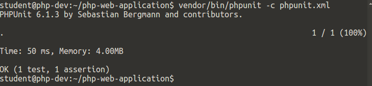

# Labb 7, Tester och refaktorisering

I denna labb ska vi titta närmare på hur vi kan testa PHP-kod och refaktorisera den samma.

Vi kommer att utgå från ett existerande Composerprojekt (Johans förolämpningstjänst) och skriva tester för det. Vi kommer också att refaktorisera koden.

## Förberedelser

### Installera Curl för PHP

Curl är ett bibliotek som används för att anropa HTTP-servrar. Det används av Composer-biblioteket Guzzle.

Öppna en terminal och skriv in

```bash
$ sudo apt-get install php-curl
```

## Upplägg på labben

1. Klona det befintliga projektet.
2. Initalisera Composer och GitFlow.
3. Testa koden.
4. Refaktorisera koden.

## 1. Klona det befintliga projektet

Vi är intresserade av Johans gamla demoprojekt på [https://github.com/koddas/php-web-application](https://github.com/koddas/php-web-application). Klona det genom att skriva

```bash
$ git clone https://github.com/koddas/php-web-application
```

## 2. Initalisera Composer och GitFlow

### 2.1. Installera Composer-beroenden

Installera projektets beroenden med hjälp av Composer:

```bash
$ composer install
```

Säkerställ att projektet körs ordentligt genom att gå in i katalogen *php-web-application/src/* och starta utvecklingsservern:

```bash
$ cd php-web-application/src/
$ php -S localhost:8000
```

Gå sedan in på [http://localhost:8000](http://localhost:8000) och se om du ser en webbsida.

### 2.2. Initialisera GitFlow

Vi kommer att använda oss av GitFlow för att skapa en branch för att skriva enhetstester. Gör detta genom att skriva följande i teminalen:

```bash
$ cd ..
$ git flow init -d
```

Gå igenom guiden som vanligt (se [Laboration 2](https://github.com/mah-dv/da288a-vt18/blob/master/Labs/2/git.md)). Notera gärna att *src/vendor* redan ligger i *.gitinit*.

## 3. Testa koden

Vår kod fungerar, vad vi kan se. Vi kan inte vara säkra på hur väl det faktiskt fungerar, dock.

### 3.1. Skapa en feature-branch

Skapa en feature-branch för testskrivandet genom att skriva

```bash
$ git flow feature start unit_tests
```

### 3.2. Lägg till PHPUnit med Composer

Vi behöver lägga till PHPUnit (se [https://phpunit.de](https://phpunit.de)) till vårt projekt för att kunna skriva våra tester. Detta ska göras till våra utvecklingsberoenden (require-dev):

```bash
$ composer require --dev
```

Sök efter *phpunit* och välj sedan det översta alternativet.

### 3.3. Sätt upp testmiljön

Nästa steg är att sätta upp PHPUnits testmiljö. Verktyget har en föredragen fil- och katalogstruktur som vi måste följa. PHPUnit föredrar när våra tester ligger i katalogen *tests/*, så vi skapar en sådan:

```bash
$ mkdir tests
```

I vår projektrot skapar vi sedan konfigurationsfilen *phpunit.xml* med följande innehåll:

```xml
<phpunit bootstrap="vendor/autoload.php">
<testsuites>
    <testsuite name="Tests">
        <directory>tests</directory>
    </testsuite>
</testsuites>
</phpunit>
```

Skapa sedan filen *tests/bootstrap.php* med följande innehåll:

```php
<?php
require dirname(__DIR__) . '/vendor/autoload.php';
```

### 3.4. Skriv tester

Vi börjar så smått med att skriva ett enkelt test. Vi vill testa att hämta ett namn med hjälp av metoden *get_name()* i klassen *Utils*. Vi skapar därför en fil *tests/UtilsTest.php* med följande innehåll:

```php
<?php
declare(strict_types=1);

use PHPUnit\Framework\TestCase;

require dirname(__DIR__) . '/src/Utils.php';

final class UtilsTest extends TestCase
{
    public function testGetNameWithValidValue()
    {
        $utils = new Utils();
        $this->assertEquals("Axel", $utils->get_name(1981, 6, 16));
    }
}

```

Den här filen är på intet sätt fullständig, men duger bra för tillfället.

### 3.5. Kör testerna

Testsviten kör du genom att skriva följande i terminalen:

```bash
$ vendor/bin/phpunit -c phpunit.xml
```

Om utskriften ser ut som nedan har ditt testfall gått igenom:



### 3.6. Skriv fler tester

Det är viktigt att testa inte bara det som uppenbart fungerar, utan även gränsfall och saker som inte ska fungera. Det här blir en övning för dig att göra. Skriv ett antal relevanta testfall för varje metod i *Utils*. Exempel på saker som du kan testa för *get_name* är:

* Negativa årtal
* Den första och sista dagen i varje månad
* Månad 13
* Månadsnamn istället för två siffror
* Månad eller dag med bara en siffra
* Skicka med en array eller boolean som indata

### 3.7. Fixa trasig kod

Förhoppningsvis har du nu stött på en massa fel i koden. Om inte, gå tillbaka och skriv fler tester. Det finns många skavanker i koden.

Din uppgift är nu att åtgärda felen på ett sätt så att alla dina testfall går igenom. Notera gärna att en fix som löser ett testfall kan resultera i att ett annat testfall inte längre går igenom.

### 3.8. Mergea in i develop

När du är färdig, mergea in din test-branch genom att i terminalen skriva:

```bash
$ git flow feature finish unit_tests
```

## 4. Refaktorisera koden

Du har säkert varit med om att du öppnat upp gammal kod som du själv skrivit och konstaterat att det inte varit någon vacker läsning. Programmet kanske fungerar, men koden ger en dålig smak i munnen. Du har just varit med om [code smell](https://en.wikipedia.org/wiki/Code_smell), vilket är en magkänsla som förknippas med kod som är mindre bra.

### 4.1. Refaktorisera Johans kod

Koden har, trots sin numera klanderfria funktion, fortfarande små skavanker. Exempelvis har den metodnamn som använder *snake_case* istället för *camelCase*. Åtgärda detta och se till så att testfallen fortfarande går igenom. När du är klar, se om du kan hitta några fler fall av code smell och åtgärda dem.

### 4.2. Refaktorisera din egen kod

Öppna upp tidigare laborationsuppgifter och refaktorisera dem. Vilka typer av code smell hittar du i dem? Hur fixar du dem? Diskutera med en kursare.
