# Labb 8, Delivery, Deployment & Integration

I denna labb ska vi sätta upp en miljö för Continuous Integration & Delivery. Vi kommer att utgå från projektet som gjordes i lab 7.

## Upplägg på labben

1. Skapa en App Services-instans i Azure.
2. Pusha förra veckans labbuppgift till GitHub.
3. Förbered Travis CI.
4. Konfigurera projektet.
5. Kontrollera att allt fungerar.

## Förberedelser
Inför denna labb ska du ha **skapat ett konto på Azure**. Detta gör du genom att gå in på universitetets [Microsoft Imagine-portal](https://www.mah.se/itservice/programvara#dreamspark) och logga in med din datorinlogging. Du måste eventuellt sitta på universitetets nätverk för att detta ska fungera. Välj sedan valet *New Microsoft Azure for Students - Microsoft Imagine* och följ vidare instruktioner där.

## 1. Skapa en App Services-instans i Azure

[Microsoft Azure](https://portal.azure.com) är Microsofts tjänst för cloud computing. Tjänster erbjuder lösningar för IaaS, PaaS och SaaS. Vi kommer i den här labben att titta på en PaaS-lösning genom att sätta upp en App Services-instans för PHP.

### 1.1. Logga in på Azure

Det första vi måste göra är att logga in på Azure. Börja med att gå in på [https://portal.azure.com](https://portal.azure.com).

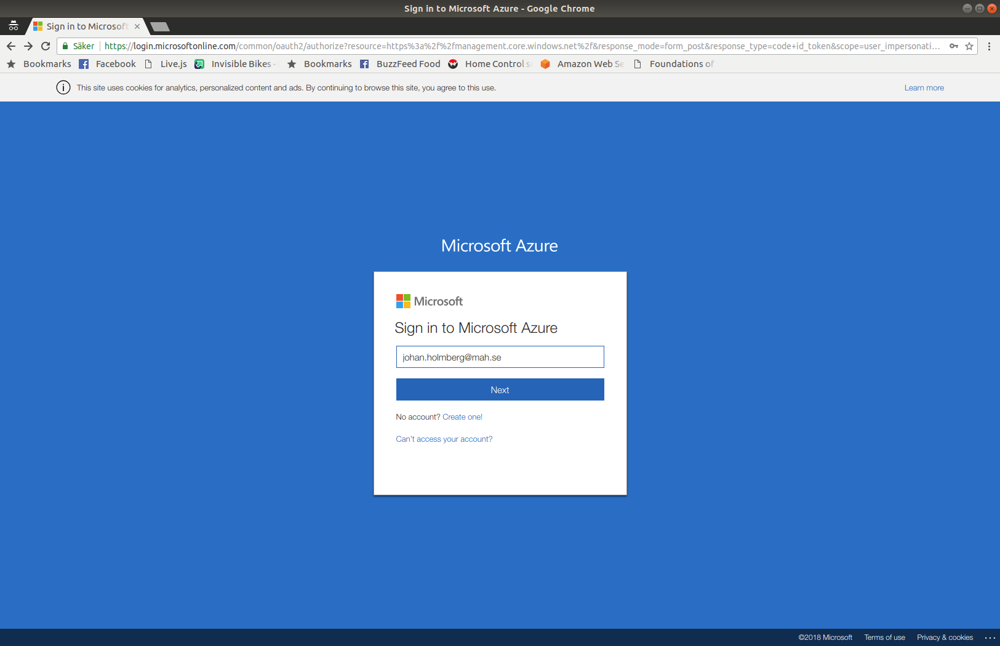

Ange en e-postadress på mah.se-domänen. Eftersom du troligtvis inte har en egen kan du ange vad som helst, exempelvis *fsjal@mah.se*. Det viktiga är att Azure känner igen att du vill använda en inloggning från MAU. Observera att det måste vara ***@mah.se*** och inte mau.se, även om vi gått och blivit universitet. Du kan nu ange ditt dator-id och lösenord för att logga in.

### 1.2. Skapa och konfigurera din App Services-instans

När du har loggat in möts du av din instrumentpanel. Klicka på alterntivet *Create a resource*.

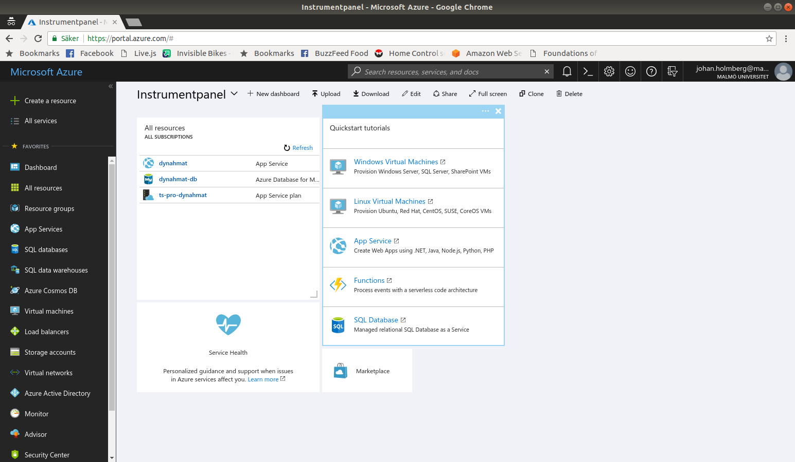

Du kommer nu till en vy där du kan välja vilken typ av resurs du vill skapa. Välj resurstypen *Web App* (se bild).

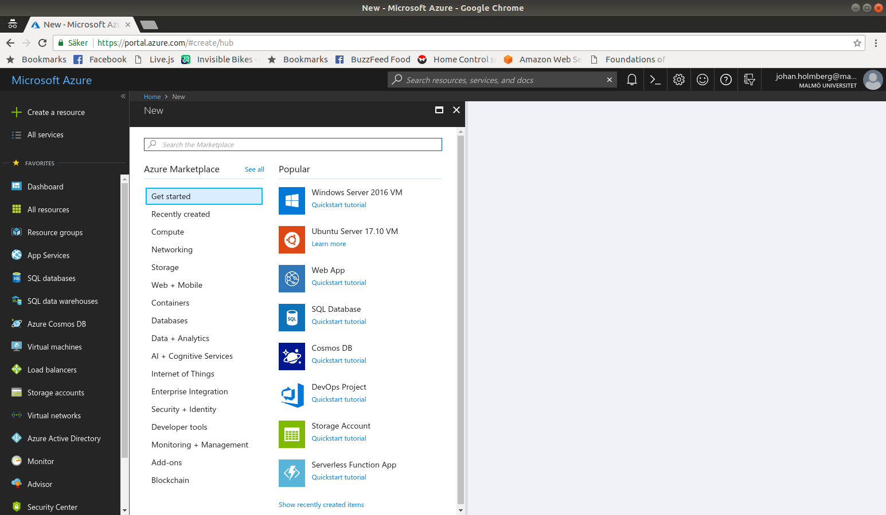

När du gjort det, tas du till arbetsflödet för skapande av webapplikationer. Ditt första steg är att välja ett namn för din applikation. Detta namn måste vara globalt unikt, eftersom applikationen du skapar kommer att vara nåbar på *valt_namn.azurewebsites.net*. Det gör att du konkurrerar med hela världen om bra namn. Ett tips är att välja ett namn i stil med *da288a-minhäftigaapplikation*. Här väljer du även den prenumeration du vill använda. Du bör ha ett enda val här. Johan, som jobbar på IT-avdelningen, har lite fler och väljer därför *Enterprise Dev/Test*. Du har en egen.

I samma vy måste du även skapa en resursgrupp. Azure kommer att föreslå samma namn som du har på din applikation. Godkänn det. Vi kommer inte att titta vidare på resursgrupper i kursen.

Det sista du gör innan du går vidare är att välja vilken typ av miljö du vill använda. Välj *Linux* som operativsystem och avsluta med att välja Runtime Stack *PHP 7.2*. Klicka sedan på *Create* och vänta en stund medan resursen skapas. Det kommer att ta ett tag.

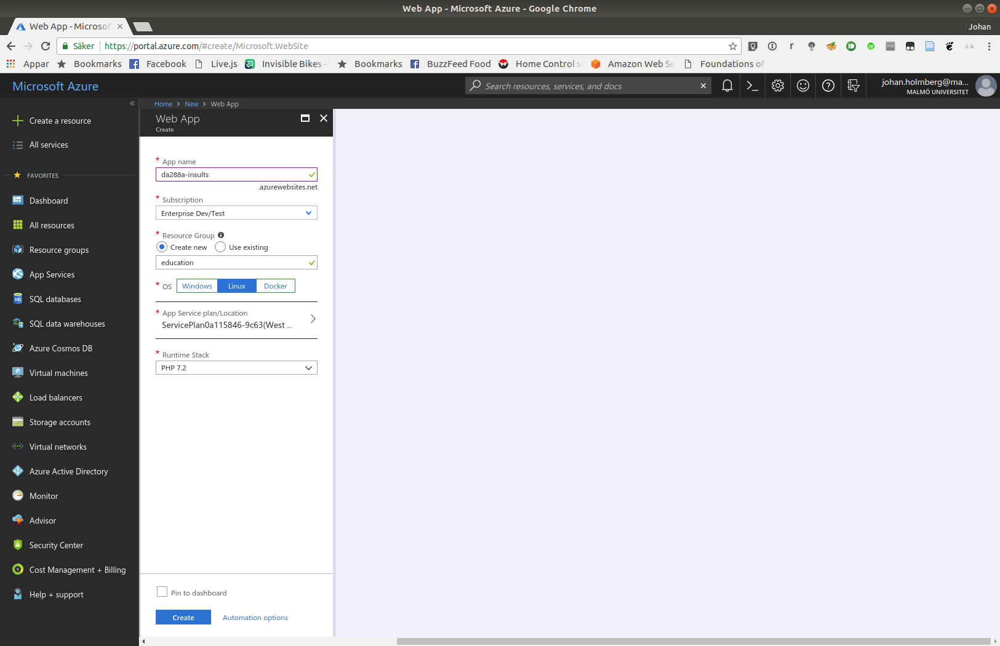

När din App Service är färdigskapad kommer du att få en notifiering. När du klickar på notifieringen kommer du att se information om din nya tjänst. Klicka på *Pin to Dashboard* för att skapa en genväg till startskärmen och sedan på *Go to resource* för att öppna den.

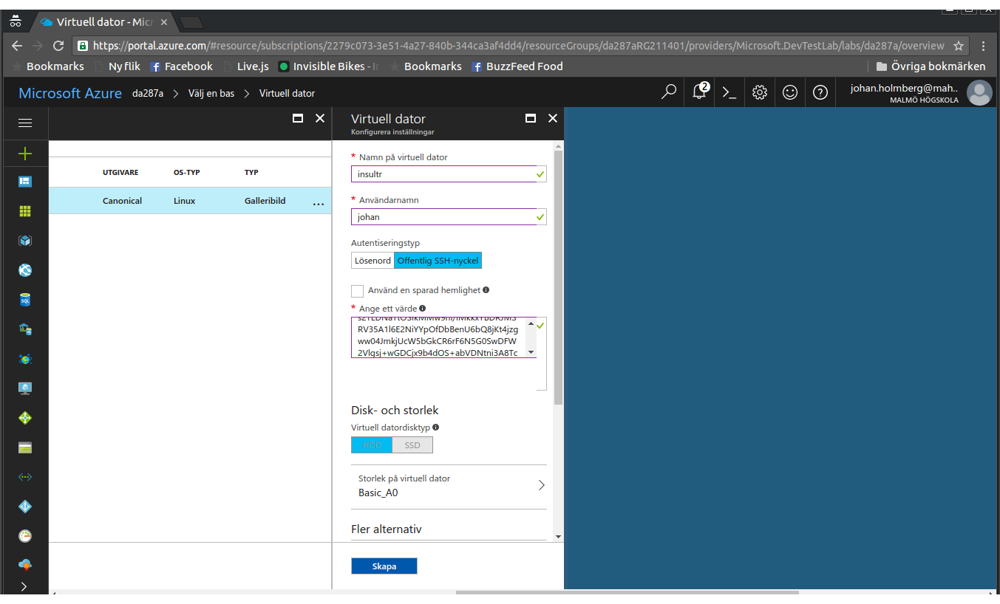

Nu ser du din tjänst och information om den. Här kan du se enklare loggar och annan relevant information.

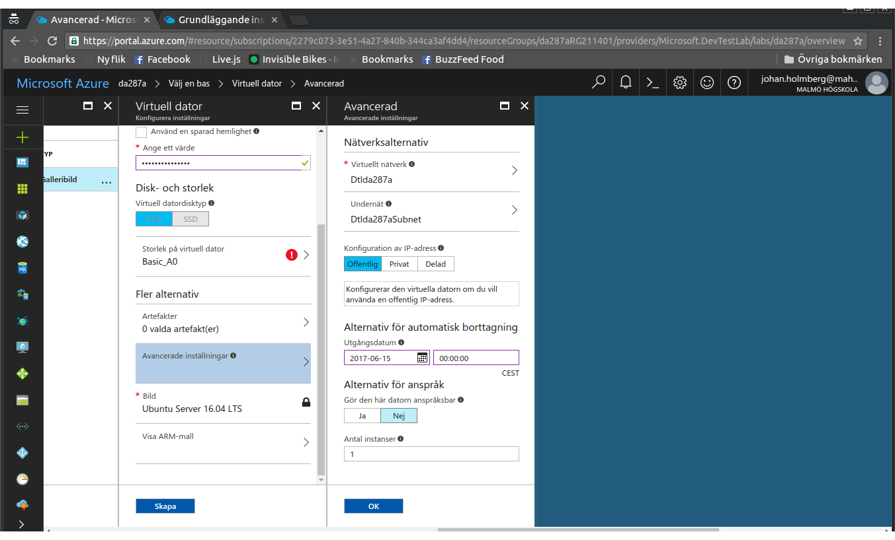

Testa att klicka på *URL* för att öppna upp din nyskapade tjänst. Den kommer att se ut så här:

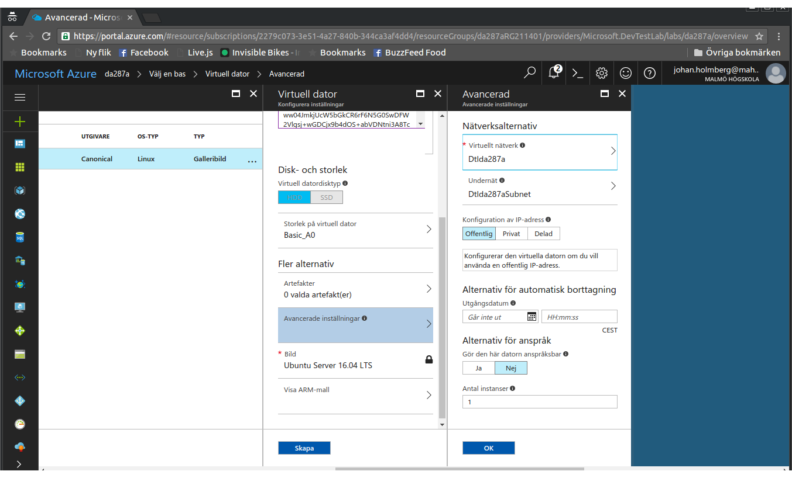

### 1.3. Förbered din Web App för leverans och driftsättning

Konfigurationen av din nya tjänst är nu klar. Nu ska du förbereda Azure för leverans från Travis CI. Börja med att klicka på *Deployment credentials* och välj ett användarnamn och lösenord. Ditt användarnamn måste vara globalt unikt, så välj något klurigt. Johan valde exempelvis *da288a-johan*.

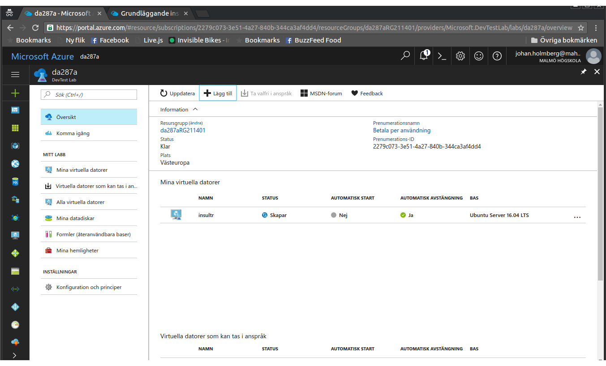

Klicka sedan på *Deployment options* och välj *Local Git Repository*. Märk väl att vi inte väljer att använda oss av GitHub här, eftersom vi vill köra testerna på Travis CI innan vi levererar och driftsätter. Klicka sedan på OK.


## 2. Förbered ditt projekt för leverans och driftsättning

Om du inte gjorde förra veckans labbuppgift - gör den innan du gör den här labben. Om du redan har pushat den till GitHub kan du hoppa över hela den här deluppgiften.

### 2.1. GitHub

Gå till GitHub och skapa ett tomt, publikt repository. Lägg inte till något i det, ingen .gitignore och ingen README. Kom ihåg vad du har sparat det som. I vårt exempel heter vårt repository *insultr* och vi använder Johans GitHub-alias *koddas*. Du använder så klart ditt eget GitHub-alias istället.

### 2.2. Ditt lokala repository

Öppna terminalen och gå till katalogen där du sparade förra veckans labbuppgift. Peka om projektet på ditt nya GitHub-repository så här:

```bash
$ git remote set-url origin https://github.com/koddas/insultr
$ git remote add upstream https://github.com/koddas/insultr
$ git push
```

Nu finns förra veckans labbuppgift tillgänglig på GitHub.

### 2.3. Gör en test-driftsättning

Gå till instumentpanelen i Azure och öppna din Web App om den inte redan är öppen. Leta upp *Git clone url* och kopiera den. I Johans fall är denna

```
https://da288a-johan@da288a-insults.scm.azurewebsites.net:443/da288a-insults.git
```

När du har kopierat URL:en öppnar du upp en terminal och skriver

```bash
$ git remote add azure https://da288a-johan@da288a-insults.scm.azurewebsites.net:443/da288a-insults.git
```

Byt ut URL:en mot din egen.

För att driftsätta ditt projekt kör du följande kommando:

```bash
$ git push azure master
```

Om allt fungerar som det ska, kommer du snart att kunna komma åt din applikation på *http://din-applikation.azurewebsites.net*.

:warning: Om din applikation inte startar ordentligt, tänk på att din index-fil måste ligga i roten i ditt projekt.

### 2.4. Läs vidare om MySQL på Azure

Om du använder en databas i ditt projekt, kan du behöva dra igång en MySQL-server på Azure. Det här gör du inte på din App Service, utan genom att starta upp en MySQL-resurs. Läs [mer om det här](https://docs.microsoft.com/sv-se/azure/mysql/quickstart-create-mysql-server-database-using-azure-portal). Du kan också behöva ställa om Laravel till att använda den externa database. [Här finns en post](https://laravel.com/docs/5.6/database) som beskriver hur du gör.

## 3. Förbered Travis CI

### 3.1. Skapa ett konto hos Travis CI

Gå in på [Travis CI](https://travis-ci.org/) och logga in på ditt GitHub-konto. Detta behöver du göra för att Travis CI ska kunna se dina projekt på GitHub. När du loggat in ser du dina publika GitHub-projekt (vill du använda Travis CI för privata projekt får du betala för det). Välj det projekt som du vill automatbygga med Travis CI, exempelvis *koddas/insultr*. Det ser ut så här: 

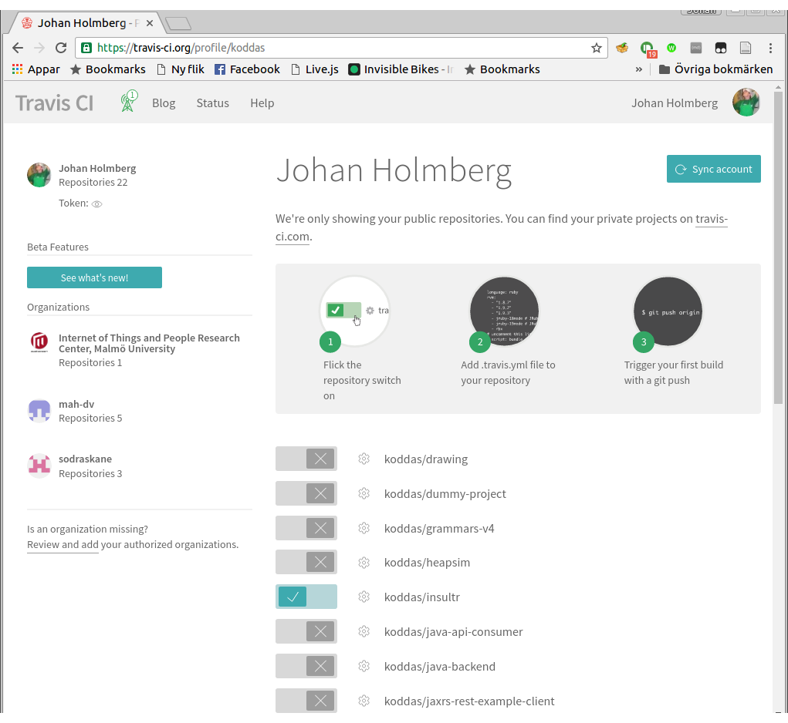

### 3.2. Skapa miljövariabler

Klicka på det lilla kugghjulet bredvid ditt projektnamn. Du kommer nu till en sida där du kan skapa *miljövariabler* (engelska: *environment variables*). Dessa kommer vi att använda oss av i bygget för att undvika att spara känsliga uppgifter i konfigurationsfilen som sedan publiceras på GitHub.

Vi vill skapa tre miljövaribler: `AZURE_WA_USERNAME`, som är det användarnamn som du angav i steg 1.3, `AZURE_WA_PASSWORD`, som är lösenordet från samma steg, och slutligen `AZURE_WA_SITE`, som är namnet på din applikation, exempelvis *da288a-insultr*. Glöm inte att dölja lösenordet!

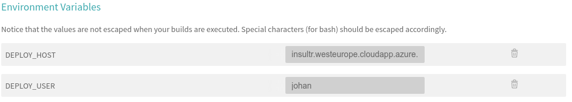

## 4. Konfigurera projektet

Travis CI styrs av ett gäng direktiv, inte helt olikt hur vi berättar för Composer hur den ska hantera vårt PHP-projekt. För att detta ska fungera behöver vi skapa en fil som heter *.travis.yml*. Notera punkten i början av filen. Den är där för att, precis som vår gamla kompis *.gitignore* berätta för operativsystemet att det här är en speciell fil som för det mesta inte behöver synas för användaren, i det här fallet PHP-utvecklaren.

Stå kvar i din projektkatalog (om du inte gjorde steg 2: gå till din projektkatalog) och skapa en tom fil genom att skriva

```bash
$ nano .travis.yml
```

Nu är det dags att skriva filen. Vi kommer att skriva filen i ett sjok och sedan förklara varje direktiv för sig. Kopiera in följande text i filen och spara den sedan:

```
os:
- linux
cache:
  directories:
  - "$HOME/.composer/cache"
language: php
php:
- 7.2
install:
- composer install
script:
- phpunit --configuration phpunit.xml --coverage-text
deploy:
  provider: azure_web_apps
  verbose: true
notifications:
  email:
    recipients: din.egen.epostadress@domän.se
```

Så, vad betyder de olika delarna? Från topp till slut:

```
os:
- linux
```

Här berättar vi för Travis CI att vi kommer att använda en Linux-server som målmaskin. Detta gör att Travis CI kommer att köra alla byggen och tester på en Linux-maskin.

```
cache:
  directories:
  - "$HOME/.composer/cache"
```

Här berättar vi att vi vill spara undan filer som kommer att laddas ner ofta. I praktiken innebär det att vi sparar undan Composer-paketen.

```
language: php
php:
-7.2
```

Här berättar vi att applikationen är en PHP-applikation, och att vi vill att Travis CI ska testa och validera för version 7.0. Vi kan, om vi vill, ange fler versioner genom att lägga till fler rader (exempelvis `-5.6` eller `-7.1` ).

Nästa steg kräver att vi förstår hur Travis CI fungerar. Verktyget gör ett bygge i tre faser: *install*, * script* och *deploy*. Dessa faser har dessutom två stycken extra-faser för varje huvudfas: `before_` och `after_`, vilka används för att förbereda och städa upp. Varje fas har en specifik uppgift:

* I *install*-fasen installerar Travis CI alla beroenden som applikationen har för att kunna köras:

```
install:
- composer install
```

* I *script*-fasen körs alla tester. När och om dessa går igenom kommer Travis CI sedan att genomföra själva bygget. I vårt fall med PHP innebär det att Travis CI faktiskt inte gör någonting, men om vi gjort ett projekt i exempelvis Java eller C# hade det här inneburit att koden kompilerats och paketerats. Eventuell automatisk dokumentationsgenerering sker också nu:

```
script: phpunit --configuration phpunit.xml --coverage-text
```

* I *deploy*-fasen driftsätts koden. I vårt fall innebär det att Travis CI ska lyssna på när vi gör en push av vår master-branch till GitHub. När detta sker, ska Travis CI ta koden och skicka den till Azure:

```
deploy:
  provider: azure_web_apps
  verbose: true
  on:
    branch: master
```

Slutligen vill vi att Travis CI meddelar oss när ett bygge är avslutat, oavsett om det gick bra eller inte:

```
notifications:
  email:
    recipients: din.egen.epostadress@domän.se
```

## 5. Kontrollera att allt fungerar

Pusha dina förändringar till GitHub. Gå sedan in på [Travis CI](https://travis-ci.org/) och titta på ditt projekt. Bygger det som det ska? Det borde det göra. Oavsett om det fungerar eller inte, kommer du att få ett mail med information om hur bygget gick. Titta på det.

När bygget är färdigt (och har lyckats), gå in på din nya tjänst (exempelvis [da288a-insults.azurewebsites.net](https://da288a-insults.azurewebsites.net)) och kontrollera att det fungerar.

Nedan syns en statusskärm på Travis CI med två projekt igång. Det översta, *koddas/insultr*, har inte lyckats byggas. Det undre, som också syns på huvudskärmen, har lyckats och är därför grönt.

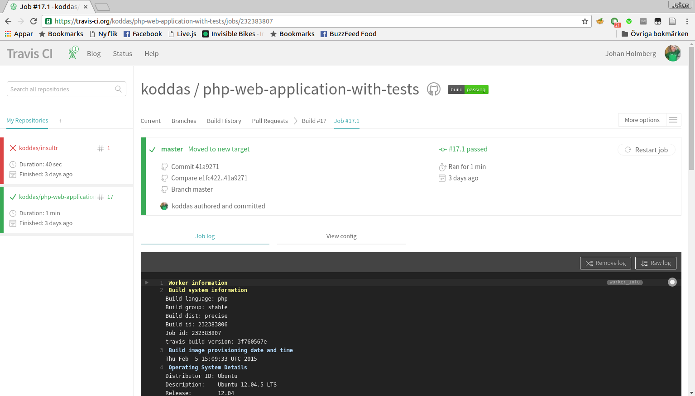

Nu har du skapat en applikation, satt upp en toolchain för CI/CD och borde vara nöjd med dig själv. Wohoo!
